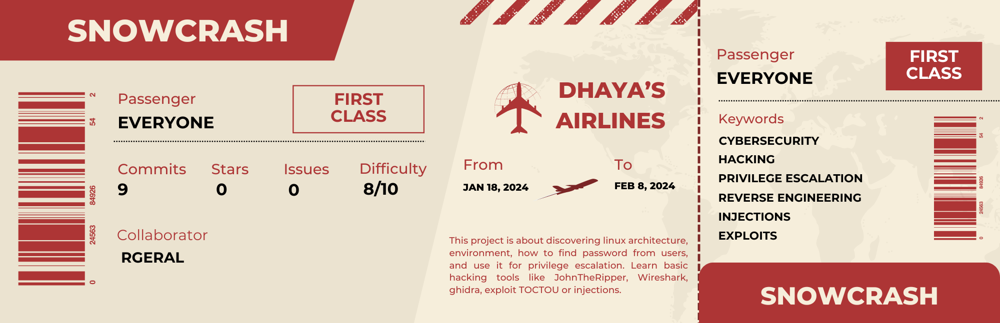

<p aligne="center">
    
</p>

<h1 align="center">
    SnowCrash
</h1>

<p align="center">
	<b><i>Cybersecurity project to learn basic exploitations on linux machines.</i></b><br>
</p>

Welcome to our very first project only focused on Cybersecurity, SnowCrash. The principle is pretty straightforward, it's a capture the flag, where we have to find a total of 15 flags to go from level00 to level14 (including the bonus part).

This project has been done with [@Rgeral](https://github.com/Rgeral) a great friend of mine, and we did this project in approximatively 2 weeks.

## Organisation

Each exercice will be organized like so:
```
levelXX/
├─ resources/
│  └─ resources1.txt
├─ flag
└─ README.md
```
The level's folder, then a resources folder if necessary (containing level informations, or useful files created for finding the flag), then the actual flag for next level, and finally a README.md containing explanations  on how we made it.

## New Skills (from the highest one to lowest one)

- [x] General knowledges on Linux environment.
- [x] Reverse engineering ([Ghidra](https://ghidra-sre.org)).
- [x] Encryption / Decription on hashes.
- [x] Command injections.
- [x] Network troubleshooting analysis ([WireShark](https://www.wireshark.org)).
- [x] Session / Password handling on Linux.
- [x] Web injections.
- [x] CRON behaviors.
- [x] Time-Of-Check Time-Of-Use attacks. 
- [x] Assembly code.
- [x] Python scripts.

## What's next ?

This project is part of the CyberSecurity branch of 42 School, the aim now is to continue this branch and go as far as possible, next one is a project in collaboration with [HackTheBox](https://www.hackthebox.com). I should continue this branch with [@Rgeral](https://github.com/Rgeral).
